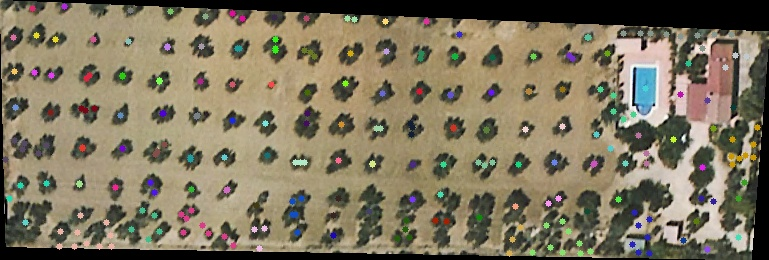

# Olive-Segmentation
Basic implementation of a script for the detection of olive trees in agricultural plots using computer vision and clustering techniques.

## Local installation

If desired, the code can be executed locally. To do so, just execute the following commands:

For a Windows operating system
```bash
gh repo clone PabloLHo/Olive-Segmentation
cd Olive-Segmentation/Ejecutable
ejecutable.bat
```

For a Linux operating system
```bash
gh repo clone PabloLHo/Olive-Segmentation
cd Olive-Segmentation/Ejecutable
ejecutable.sh
```

## Development

The development of this script arises with the idea of optimising a functionality for a computer engineering dissertation that can be found [here](https://github.com/PabloLHo/Prototipo-Aplicacion-WebGL.git). The idea is to obtain a possible location of olive trees within a plot of land.

For this we worked with the OpenCV and DBSCAN libraries to be able to work with satellite images. With OpenCV we perform a contour detection after applying multiple classic operations of the library, thanks to these we can isolate the contours by zones and delimit olive tree positions. 

Finally, DBSCAN is used to apply clustering on the identified areas, limiting the results that appear very close under a given distance threshold.


## Execution examples

### Execution of the algorithm for a specific plot of land
First we present the image of the parcel in question, the image is a satellite orthophoto of the area.
<p align="center">
  
</p>


As soon as we run the code we will obtain two results, a first one with the identification of the possible points with olive trees and a second one with the clustering carried out on these points to centralise the olive tree.
<p align="center">
  
</p>


<p align="center">
  
</p>

Finally, as we can see, the classification process is not perfect, but it is only a simple script to obtain first results in this field and can be improved later on.

